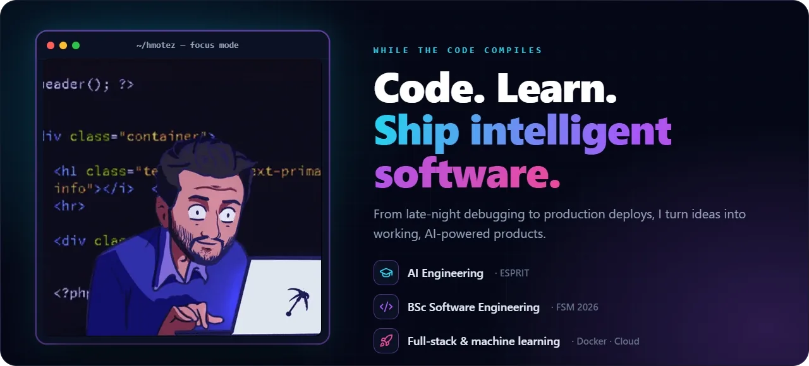

  

  

&nbsp;

 
&nbsp;

 

-  &nbsp;Now in the **AI Engineering** cycle at **[ESPRIT](https://esprit.tn)** (2026 → today), after my **BSc in Software Engineering & Information Systems** from the Faculty of Sciences of Monastir (2026).
-  &nbsp;Final-year internship at **ACTIA Engineering Services**: an ISO 9001 document management system, from architecture to Docker deployment, with NLP-based quality analysis.
-  &nbsp;Building **ML-powered full-stack products**. Latest: the [AI Medical Assistant](https://medai-hmotez.onrender.com), live.
-  &nbsp;Going deeper into **machine learning, NLP and putting models into production**.
-  &nbsp;Looking for an **alternance**: let's talk.

 

 

<picture>
  <source media="(prefers-color-scheme: dark)" srcset="./profile-3d-contrib/profile-night-rainbow.svg" />
  <source media="(prefers-color-scheme: light)" srcset="./profile-3d-contrib/profile-green-animate.svg" />
  
</picture>

<picture>
  <source media="(prefers-color-scheme: dark)" srcset="./assets/snake/snake-dark.svg" />
  <source media="(prefers-color-scheme: light)" srcset="./assets/snake/snake-light.svg" />
  
</picture>

Both are regenerated every day by a GitHub Action.

  

| Language | Level |
|---|---|
| Arabic | Native |
| French | Fluent |
| English | Fluent |

-  &nbsp;Continuous learning in AI, machine learning and software engineering
-  &nbsp;Building and experimenting with personal and academic projects
-  &nbsp;Motion design and 3D on the web

