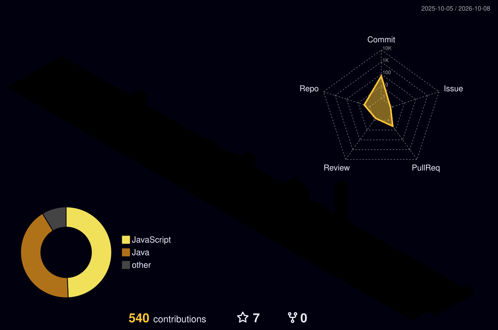

  

  <strong>AI Engineering Student @ ESPRIT</strong> | Software Engineering graduate (FSM 2026) | Based in Tunisia | Passionate about AI &amp; technology

  
  
  
  

---

## 👋 About me

- 🎓 Now in the **AI Engineering** cycle at **[ESPRIT](https://esprit.tn)** (2026 → today), after my **BSc in Software Engineering & Information Systems** from the Faculty of Sciences of Monastir (2026).
- 💼 Final-year internship at **ACTIA Engineering Services**: an ISO 9001 document management system, from architecture to Docker deployment, with NLP-based quality analysis.
- 🔭 Building **ML-powered full-stack products**. Latest: the [AI Medical Assistant](https://medai-hmotez.onrender.com), live.
- 🌱 Going deeper into **machine learning, NLP and putting models into production**.
- 🤝 Looking for an **alternance**: let's talk!

---

## 🚀 Featured projects

<table>
  <tr>
    <td width="50%" valign="top">
      <h3>🩺 AI Medical Assistant</h3>
      
AI triage platform: describe symptoms in free text (EN/FR) and get calibrated top-5 conditions, urgency, the right specialist and per-symptom explanations, with verified-doctor review.

      
<code>FastAPI</code> <code>React</code> <code>scikit-learn</code> <code>PostgreSQL</code> <code>Docker</code>

      
      
    </td>
    <td width="50%" valign="top">
      <h3>✨ 3D Portfolio</h3>
      
Motion-design portfolio with real-time 3D: holographic portrait card, kinetic typography, smooth scroll, EN/FR and dark/light themes. Dockerized and deployed on Render.

      
<code>React</code> <code>Three.js</code> <code>Framer Motion</code> <code>Tailwind</code> <code>Docker</code>

      
      
    </td>
  </tr>
  <tr>
    <td width="50%" valign="top">
      <h3>💊 TrueCare AI</h3>
      
Predicts medical reimbursement amounts and detects fraud from medical documents, insurance policies and regulations.

      
<code>Python</code> <code>Machine Learning</code> <code>NLP</code>

      
    </td>
    <td width="50%" valign="top">
      <h3>🎓 University SOA System</h3>
      
University management system built on REST and SOAP services, secured with JWT and orchestrated with Docker Compose.

      
<code>Spring Boot</code> <code>Java</code> <code>REST</code> <code>SOAP</code> <code>Docker</code>

      
    </td>
  </tr>
  <tr>
    <td width="50%" valign="top">
      <h3>📄 GED — ISO 9001 Quality System</h3>
      
Document management for ACTIA Engineering Services: role-based validation workflows, real-time notifications and AI quality analysis.

      
<code>Node.js</code> <code>React</code> <code>PostgreSQL</code> <code>Docker</code> <code>NLP</code>

      
    </td>
    <td width="50%" valign="top">
      <h3>🏨 Hotel Management System</h3>
      
Desktop app for staff, rooms and bookings with real-time availability checks.

      
<code>Java</code> <code>JavaFX</code> <code>MySQL</code>

      
    </td>
  </tr>
</table>

---

## ⚡ Technologies & Tools

**🧠 AI & Data** 

**🧑‍💻 Programming Languages** 

**🌐 Web Development** 

**⚙️ Backend & Frameworks** 

**🗄️ Databases** 
 &nbsp;+ Oracle

**🖥️ Systems & DevOps** 

**🎮 Other Tools** 

---

## 📈 My GitHub activity in 3D

<picture>
  <source media="(prefers-color-scheme: dark)" srcset="./profile-3d-contrib/profile-night-rainbow.svg" />
  <source media="(prefers-color-scheme: light)" srcset="./profile-3d-contrib/profile-green-animate.svg" />
  
</picture>

<picture>
  <source media="(prefers-color-scheme: dark)" srcset="./assets/snake/snake-dark.svg" />
  <source media="(prefers-color-scheme: light)" srcset="./assets/snake/snake-light.svg" />
  
</picture>

Both are regenerated every day by a GitHub Action.

---

## 🗺️ Language Proficiency

- **Arabic:** Native
- **English:** Fluent
- **French:** Fluent

## 🎯 Hobbies & Interests

- 📚 Continuous learning in AI, machine learning and software engineering
- 💻 Building and experimenting with personal and academic projects
- 🎨 Motion design and 3D on the web

